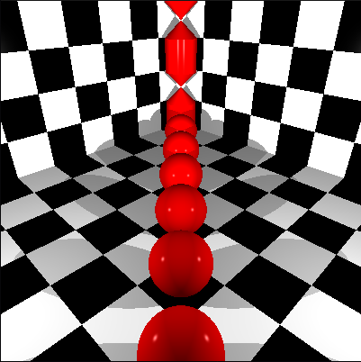

<h1 align=center>
	<b>MiniRT</b>
</h1>

<h2 align=center>
	 <i>42cursus' project #11</i>
</h2>

<p align=center>
Ray tracing is a rendering technique that can produce stunningly realistic and beautiful lighting effects. Essentially, it is based on an algorithm that can trace the path of light, and then simulate the way it interacts with the virtual objects it ultimately hits in the computer-generated world. It's mathematics, algorithm and a whole lot of abstraction. This project aims to introduce the basics of this algorithm, in what is probably one of the most complex and intriguing 42 projects so far.
  
</p>

---

<div align=center>
<h2>
	Final score
</h2>


<h4>Completed + Bonus</h4>

</div>

---

<h2>
The project
</h2>

### What is a Ray Tracer



A ray tracer is a computer program that simulates the behavior of light in order to generate realistic images. It works by tracing the path of rays of light as they interact with objects in a virtual scene, ultimately determining the color and brightness of each pixel in the final image.

The basic idea behind a ray tracer is to simulate the physical phenomena of light, such as reflection, refraction, and shading, to create visually accurate renderings. It starts by casting a primary ray from the viewer's perspective through each pixel of the image plane. This primary ray determines the direction of the incoming light for that pixel.

When the primary ray intersects with objects in the scene, the ray tracer calculates how the light interacts with those objects. It checks for reflections, where the ray bounces off a surface and continues in a new direction, and refractions, where the ray passes through transparent materials and changes direction based on the material's properties.

At each intersection point, the ray tracer performs calculations to determine the color and intensity of the light that contributes to that pixel. These calculations take into account the object's material properties, the position of light sources, and other lighting conditions. The ray tracer also considers the effects of shadows and occlusions caused by other objects in the scene.

By repeating this process for each pixel in the image and considering multiple rays of light for each pixel, a ray tracer can generate a highly realistic image with accurate lighting, shadows, reflections, and refractions.

Ray tracing is widely used in various fields, including computer graphics, video games, animation, and visual effects. It provides a powerful tool for creating visually stunning and realistic images by simulating the physics of light in a virtual environment.

In our Mini Ray Tracer, we've implemented a simplified version of this process using the C programming language. Our program takes a scene description, calculates ray-object intersections, and simulates light interactions to produce rendered images. In the following sections of the documentation, we will delve into the specifics of our implementation and explain how various components and algorithms work together to achieve the desired results.

### A Ray Tracer in C?! Are we crazy? 

When developing a ray tracer in C, we've encountered several challenges due to the nature of the language. C is a procedural programming language that lacks built-in support for higher-level abstractions like classes and objects, which are fundamental to OOP. As a result, we had to handle various aspects manually, leading to increased complexity and potential pitfalls.

- **Lack of encapsulation**: In C, encapsulation must be implemented manually by defining structures and functions that operate on them. This requires careful management of data structures and associated functions to ensure proper encapsulation and avoid data corruption or inconsistent states. OOP, on the other hand, provides a natural and intuitive way to encapsulate data and behavior within classes, promoting modularity and code organization.

- **Code reusability and maintenance**: OOP emphasizes code reuse through inheritance and polymorphism. In C, achieving similar levels of code reuse can be cumbersome and error-prone. Inheritance can be simulated using function pointers and structures, but it requires explicit management of base classes and derived classes. Polymorphism can be achieved through function pointers and dynamic dispatch, but it adds complexity and can be challenging to maintain. OOP languages, such as C++, provide built-in mechanisms for inheritance and polymorphism, making code reuse and maintenance significantly easier.

- **Memory management**: C requires manual memory management using functions like malloc() and free(). Managing complex data structures and dynamically allocated objects can be error-prone, leading to memory leaks or invalid memory accesses. OOP languages with garbage collection or automatic memory management, like Java or C#, alleviate these concerns, allowing developers to focus more on the application logic rather than low-level memory management.

- **Lack of type safety**: C is a weakly typed language, which means it allows implicit type conversions and may not catch certain type-related errors during compilation. This can lead to subtle bugs that are hard to debug and diagnose. OOP languages provide stronger type systems, enabling better compile-time checks and reducing the likelihood of type-related errors.

In contrast, implementing a ray tracer using an object-oriented language, such as C++, provides several advantages. OOP facilitates the organization of code into classes and objects, encapsulating data and behavior together. This promotes modularity, code reuse, and easier maintenance. Inheritance and polymorphism simplify the creation of specialized objects and allow for more flexible and extensible designs.

Additionally, OOP languages often provide built-in memory management mechanisms, such as garbage collection or smart pointers, reducing the burden of manual memory management and minimizing memory-related errors. The type safety offered by OOP languages also helps catch errors at compile time, enhancing code reliability.

While implementing a ray tracer in C may be more challenging due to the lack of native OOP features, it can still be a valuable learning experience and an opportunity to gain a deeper understanding of the underlying concepts. However, for larger and more complex projects, leveraging the benefits of OOP languages can significantly simplify development, improve code quality, and enhance productivity.

All of this makes miniRT the PERFECT project to end our cursus syllabus of C. It stretches our limitations and makes us even more anxious to delve into C++ in the next project. 


---
<h2>
Usage
</h2>

### Instructions

Clone this repository in your local computer:

```sh
$> git clone https://github.com/caroldaniel/42sp-cursus-minirt.git path/to/minirt
```

In your local repository, run `make`

```sh
$> make 
```

> `make` suports 7 flags:
> - `make all` or simply `make` compiles minirt in its mandatory format
> - `make clean` deletes the `.o` files generated during compilation
> - `make fclean` deletes the `.o` and the `minirt` file generated
> - `make re` executes `fclean` and `all` in sequence, recompiling the program
> - `make install` installs all dependency libraries
> - `make leak`executes the project with valgrind, checking all leaks 

